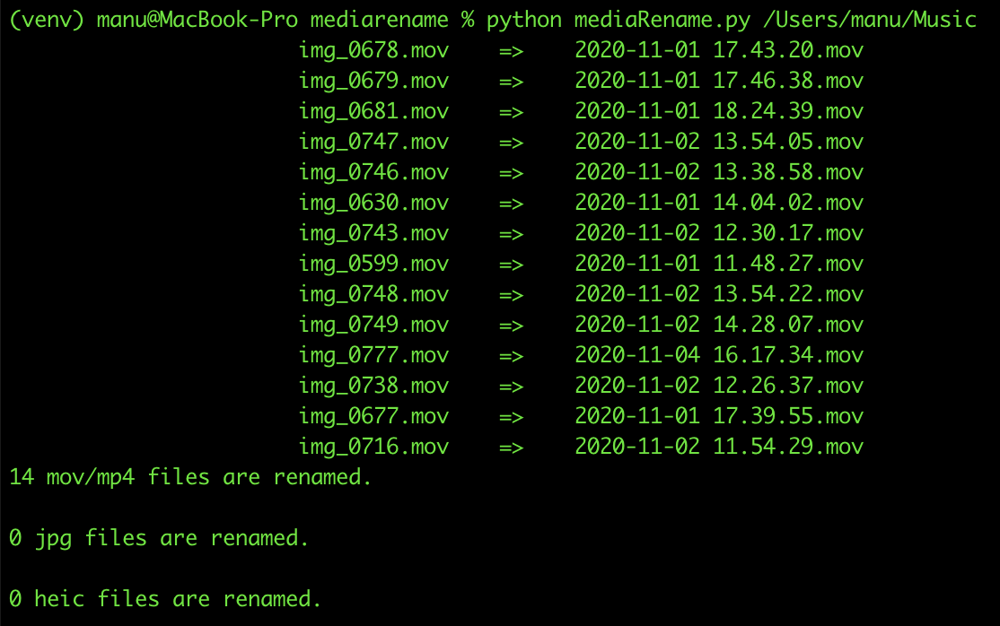

# MediaRename

**MediaRename** es una herramienta sencilla y potente escrita en Python para organizar automáticamente tus archivos multimedia. El script renombra imágenes y videos basándose en su fecha y hora de creación original (metadatos EXIF o cabeceras internas), estandarizando tus librerías de fotos al formato cronológico.

## 🚀 Funcionalidades Principales

- **Renombrado Inteligente**: Transforma nombres de archivo genéricos (ej. `IMG_2931.JPG`) a un formato cronológico ordenable: `YYYY-MM-DD HH.MM.SS`.
- **Soporte Multiformato**: Compatible con los formatos más comunes de cámaras y smartphones:
  - **Imágenes**: `.jpg`, `.jpeg`, `.heic` (High Efficiency Image File Format)
  - **Videos**: `.mov`, `.mp4`
- **Gestión de Conflictos**: Detecta si múltiples archivos tienen la misma marca de tiempo y añade automáticamente un sufijo numérico (ej: `-1`, `-2`) para evitar sobrescribir datos.
- **Normalización**: Convierte extensiones y nombres a minúsculas para mantener consistencia en el sistema de archivos.
- **Metadatos Reales**: Lee la información interna del archivo (EXIF/Atom Headers) en lugar de la fecha de modificación del sistema operativo, garantizando la precisión incluso si has movido o copiado los archivos.

## 📋 Requisitos

- Python 3.6+
- Librerías del sistema para procesar HEIC (dependiendo de tu SO, es posible que necesites librerías como `libheif` o `libffi`).

## 🛠️ Instalación

1. **Clona o descarga este repositorio**.

2. **Crea un entorno virtual** (recomendado para aislar las dependencias):

   ```bash
   python3 -m venv venv
   source venv/bin/activate
   ```

3. **Instala las dependencias necesarias**:

   ```bash
   pip install -r requirements.txt
   ```

   > **Nota para usuarios de macOS/Linux**: Si encuentras errores instalando `pyheif`, asegúrate de tener las librerías de desarrollo instaladas (ej. `brew install libffi libheif` en macOS).

## 💻 Uso

El script puede ejecutarse sobre el directorio actual o sobre una ruta específica.

### Opción 1: Ejecutar en el directorio actual
Navega a la carpeta donde tienes tus fotos y ejecuta el script:

```bash
python mediaRename.py
``` 

### Opción 2: Especificar una ruta
Pasa la ruta absoluta o relativa del directorio que quieres organizar como argumento:

```bash
python mediaRename.py /Users/usuario/Inágenes/Viaje2023
```

### Ejemplo de Ejecución



## 🔍 Detalles Técnicos

- **Zona Horaria**: El script tiene una configuración base para `Europe/Madrid`.
- **Videos**: Analiza los átomos `moov` > `mvhd` del contenedor QuickTime para extraer la fecha de creación precisa.
- **HEIC**: Utiliza `pyheif` para decodificar el contenedor y `piexif` para extraer el tag `DateTimeDigitized`.

## ⚠️ Precauciones

- Aunque el script está diseñado para no sobrescribir archivos existentes, **siempre se recomienda hacer una copia de seguridad** de tus archivos antes de ejecutar procesos de renombrado masivo.
- El script ignora archivos que ya parecen tener el formato de fecha correcto (`YYYY-MM-DD...`).
